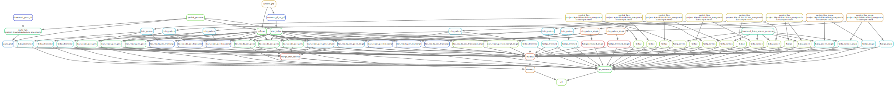

# RNA-seq Quantification Workflow

This repository contains a Snakemake workflow for bulk RNA-seq processing,
quality control, quantification, reporting, and basic DESeq2 differential
expression analysis. It was originally built around isolate RNA-seq workflows,
but now supports STAR, FeatureCounts, and Kallisto quantification modes.

For MAG-derived samples or projects with limited annotations, an alignment-based
approach is usually a better first choice than transcriptome-only
quantification. If the annotation set is sparse, consider improving annotation
before using this workflow.

The workflow supports projects that contain paired-end reads, single-end reads,
or a mixture of both.

## What The Workflow Can Do

### Input Handling

- Read sample and subsample metadata through a PEP configuration.
- Track sample-level metadata, project names, organisms, sequencing method, and
  subsample identifiers.
- Validate sample metadata, FASTQ discovery, DESeq2 condition columns, and
  configured DESeq2 reference levels before jobs are scheduled.
- Check count-matrix IDs against annotation IDs before DESeq2 starts and report
  how many overlap.
- Summarize count support by `gene_biotype` and count class when the annotation
  includes `gene_biotype`; otherwise write a report explaining that the summary
  was not calculated.
- Handle paired-end and single-end RNA-seq libraries in the same project.
- Discover FASTQ files from configurable path patterns in `config/pepconfig.yml`.
- Recognize common paired-end read name patterns such as `_R1`, `_R2`,
  `.R1`, `.R2`, `_1.fastq`, and `_2.fastq`.
- Symlink raw FASTQs into stable workflow-managed paths under `resources/`.

### Reference Preparation

- Use local genome FASTA and annotation files.
- Download remote genome FASTA and annotation files when configured.
- Symlink local references into reproducible workflow paths.
- Convert GFF/GFF3 annotations to GTF for STAR and FeatureCounts-related steps.
- Generate a transcript FASTA from the genome and annotation with `gffread`.
- Build a STAR genome index for alignment-based quantification.
- Build a Kallisto transcriptome index for transcript quantification.
- Optionally download the GUNC database for reference quality checks.

### Read Processing

- Trim paired-end reads with Trim Galore.
- Trim single-end reads with Trim Galore.
- Run FastQC on raw reads.
- Run FastQC on trimmed reads.
- Run FastQ Screen to screen reads against contaminant/reference databases.
- Include raw QC, trimmed QC, contamination screening, alignment outputs, and
  quantification outputs in MultiQC.

### Quantification

The quantification mode is controlled by `quantification_tool` in
`config/config.json`.

Supported values are:

- `star`
- `featurecounts`
- `kallisto`

#### STAR Gene Counts

When `quantification_tool` is set to `star`, the workflow can:

- Align paired-end and single-end reads with STAR.
- Produce STAR gene count files with `--quantMode GeneCounts`.
- Produce STAR transcriptome BAMs with `--quantMode TranscriptomeSAM`.
- Merge per-sample STAR gene counts into
  `results/{project}/final/quantification/star/gene_counts_all_samples.tsv`.
- Select the STAR count column by library strandedness using
  `star.gene_counts_strandedness` in `config/tools.json`.

Supported STAR count modes are:

- `unstranded`: use STAR column 2.
- `forward`: use STAR column 3.
- `reverse`: use STAR column 4.

#### FeatureCounts Gene Counts

When `quantification_tool` is set to `featurecounts`, the workflow can:

- Align paired-end and single-end reads with STAR.
- Run FeatureCounts on the resulting BAM files.
- Count configurable annotation features. The default is `gene`, which fits
  bacterial-style GFF files.
- Use a configurable annotation attribute. The default is `ID`, which matches
  common bacterial GFF gene records.
- Support unstranded, stranded, and reversely stranded counting through the
  FeatureCounts `-s` setting.
- Merge per-sample FeatureCounts outputs into
  `results/{project}/final/quantification/featurecounts/gene_counts_all_samples.tsv`.
- Include FeatureCounts summary files in MultiQC.

#### Kallisto Transcript Quantification

When `quantification_tool` is set to `kallisto`, the workflow can:

- Build a Kallisto transcriptome index from the generated transcript FASTA.
- Quantify paired-end reads with Kallisto.
- Quantify single-end reads with Kallisto using configured single-end estimates.
- Merge transcript estimated counts into
  `results/{project}/final/quantification/kallisto/transcript_counts_all_samples.tsv`.
- Merge transcript TPMs into
  `results/{project}/final/quantification/kallisto/transcript_tpms_all_samples.tsv`.

### Quality Reports

For each project, the workflow produces:

- A MultiQC HTML report.
- A per-sample QC summary table.
- A sample identity report that fingerprints expression profiles, identifies
  each sample's nearest expression neighbor, and flags low-similarity or
  metadata-discordant samples.
- A sample identity similarity matrix with all pairwise expression-profile
  correlations.
- FastQC reports for raw reads.
- FastQC reports for trimmed reads.
- FastQ Screen reports.
- STAR mapping logs when STAR is used directly or as the FeatureCounts aligner.
- FeatureCounts assignment summaries when FeatureCounts is used.
- Optional GUNC reports for reference genome quality checks.

The final QC summary table includes metadata columns, DESeq2 inclusion status,
assigned count totals, FastQC/FastQ Screen report presence, and STAR mapping
metrics when available.

### Differential Expression

The workflow runs a basic DESeq2 analysis after quantification. It can:

- Read the merged count matrix from STAR, FeatureCounts, or Kallisto.
- Read sample metadata from the CSV configured in `config/config.json`.
- Match count matrix columns to metadata sample IDs.
- Stop with a clear error when count and metadata sample names do not match.
- Use a configurable DESeq2 design formula, such as `~ Time` or
  `~ batch + Time`.
- Use a configurable reference level for that variable.
- Export a DESeq2 result table.
- Export DESeq2 normalized counts.
- Export transformed count matrices using `vst`, `rlog`, or automatic
  selection.
- Export Cook's distance gene- and sample-level outlier reports.
- Export significant, upregulated, and downregulated gene tables using the
  configured `deseq2.padj_threshold` and `deseq2.log2fc_threshold`.
- Generate modular DESeq2 plots as independent workflow jobs so one plot
  failure does not prevent unrelated plots from running.
- Write DESeq2 plots into plot-specific result directories such as
  `results/{project}/sample_distance_heatmap/`.

Generated DESeq2 plots include:

- Volcano plot: log2 fold change against adjusted p-value significance.
- MA plot: mean normalized expression against log2 fold change.
- Normalized expression boxplot: per-sample normalized count distributions.
- Normalized expression density plot: global normalized count distributions.
- Sample distance heatmap: sample-to-sample distances from transformed counts.
- PCA plot: transformed-count ordination for outliers, batch effects, and
  condition separation.
- Library size and size-factor plot: raw library sizes and DESeq2 size factors
  for detecting extreme samples.

Current DESeq2 configuration is controlled by `config/tools.json`:

- `deseq2.variable_to_analyze`
- `deseq2.reference_in_variable`
- `deseq2.design_formula`
- `deseq2.log2fc_threshold`
- `deseq2.padj_threshold`
- `deseq2.label_top_n`

## Main Outputs

For each project, final outputs are written under `results/{project}/`.

- `final/multiqc/multiqc_report.html`: combined QC report.
- `final/qc/{project}_sample_qc_summary.tsv`: per-sample QC summary table.
- `final/qc/{project}_sample_identity_report.tsv`: expression-profile sample
  identity report with nearest-neighbor correlations, metadata agreement, and
  review flags.
- `final/qc/{project}_sample_identity_similarity_matrix.tsv`: all pairwise
  sample expression-profile correlations used by the identity report.
- `count_annotation_overlap/{project}_count_annotation_overlap.tsv`: count-matrix ID and
  annotation ID overlap report.
- `gene_biotype_count_summary/{project}_gene_biotype_count_summary.tsv`: gene biotype and count
  class summary, or a message explaining that `gene_biotype` was not present.
- `final/quantification/star/gene_counts_all_samples.tsv`: STAR gene-count
  matrix when `quantification_tool` is `star`.
- `final/quantification/featurecounts/gene_counts_all_samples.tsv`:
  FeatureCounts gene-count matrix when `quantification_tool` is
  `featurecounts`.
- `final/quantification/kallisto/transcript_counts_all_samples.tsv`: Kallisto
  transcript estimated-count matrix when `quantification_tool` is `kallisto`.
- `final/quantification/kallisto/transcript_tpms_all_samples.tsv`: Kallisto
  transcript TPM matrix when `quantification_tool` is `kallisto`.
- `deseq2/{project}.tsv`: DESeq2 results table.
- `significant_gene_tables/{project}_significant_genes.tsv`: genes passing the
  configured adjusted p-value and absolute log2 fold-change thresholds.
- `significant_gene_tables/{project}_significant_upregulated_genes.tsv`:
  significant genes with positive log2 fold change.
- `significant_gene_tables/{project}_significant_downregulated_genes.tsv`:
  significant genes with negative log2 fold change.
- `normalized_counts/{project}_normalized_counts.tsv`: DESeq2
  size-factor normalized counts.
- `transformed_counts/{project}_transformed_counts.tsv`: transformed
  counts from the configured DESeq2 transform method.
- `cooks_reports/{project}_cooks_gene_report.tsv`: per-gene Cook's
  distance summary and outlier flag.
- `cooks_reports/{project}_cooks_sample_report.tsv`: per-sample
  Cook's distance summary.
- `volcano_plot/{project}_volcano_plot.png`: volcano plot.
- `volcano_plot/{project}_volcano_plot.svg`: volcano plot.
- `ma_plot/{project}_ma_plot.png`: MA plot.
- `ma_plot/{project}_ma_plot.svg`: MA plot.
- `normalized_expression_boxplot/{project}_normalized_expression_boxplot.png`
- `normalized_expression_boxplot/{project}_normalized_expression_boxplot.svg`
- `normalized_expression_boxplot/{project}_normalized_expression_boxplot.pdf`
- `normalized_expression_density/{project}_normalized_expression_density.png`
- `normalized_expression_density/{project}_normalized_expression_density.svg`
- `normalized_expression_density/{project}_normalized_expression_density.pdf`
- `sample_distance_heatmap/{project}_sample_distance_heatmap.png`
- `sample_distance_heatmap/{project}_sample_distance_heatmap.svg`
- `pca/{project}_pca.png`
- `pca/{project}_pca.svg`
- `library_sizes_size_factors/{project}_library_sizes_size_factors.png`
- `library_sizes_size_factors/{project}_library_sizes_size_factors.svg`

Intermediate outputs are written under `resources/`, `results/{project}/`, and
`logs/`. Snakemake-managed Conda environments are written under `.snakemake/`.

## Repository Layout

- `workflow/Snakefile`: top-level Snakemake entry point.
- `workflow/rules/utilities.smk`: symlinks local references and FASTQs.
- `workflow/rules/resources.smk`: prepares reference resources and indices.
- `workflow/rules/trimming.smk`: trims paired-end and single-end reads.
- `workflow/rules/metrics.smk`: runs FastQC, FastQ Screen, GUNC, MultiQC, and
  QC summary generation.
- `workflow/rules/quantification.smk`: runs STAR, FeatureCounts, or Kallisto.
- `workflow/rules/deseq.smk`: runs DESeq2 and differential-expression plots.
- `workflow/scripts/`: helper scripts for count merging, QC summaries, and
  DESeq2 plotting.
- `workflow/envs/`: Conda environment YAML files used by Snakemake.
- `config/config.json`: project-level workflow settings.
- `config/tools.json`: tool settings, resources, and analysis parameters.
- `config/pepconfig.yml`: PEP configuration for sample discovery.
- `test/`: small example data and metadata.

## Installation

Install Conda or Mamba first. Then create and activate a Snakemake environment:

```bash
conda create -n snakemake -c conda-forge -c bioconda snakemake
conda activate snakemake
```

The workflow-specific tool environments are defined in `workflow/envs/` and are
created automatically when running Snakemake with `--use-conda`.

## Test Data

The repository includes a small test reference and test sample sheets. To check
that the workflow DAG builds:

```bash
conda activate snakemake
snakemake --use-conda --cores 1 -n
```

The test FASTQs can be generated from the `test/` directory:

```bash
cd test
snakemake --use-conda --cores 4
cd ..
```

Then run the main workflow from the repository root:

```bash
snakemake --use-conda --cores 4
```

## Input Configuration

The main configuration files are:

- `config/config.json`: project-level settings, reference paths, metadata, and
  quantification choice.
- `config/tools.json`: tool resource settings and analysis parameters.
- `config/pepconfig.yml`: PEP sample table configuration.
- `test/test_samples.csv` and `test/test_subsamples.csv`: example sample
  sheets.

### Sample Table

The sample table must include:

- `sample_name`: sample identifier. This must match the sample IDs in metadata
  and the subsample table.
- `alternate_id`: optional alternate identifier.
- `project`: project name used in output paths.
- `organism`: organism or strain.
- `sample_type`: use `rna`.
- `seq_method`: `paired_end` or `single_end`.

### Subsample Table

The subsample table must include:

- `sample_name`: sample identifier from the sample table.
- `subsample`: subsample identifier used to discover FASTQ files.
- `protocol`: use `rna`.
- `seq_method`: `paired_end` or `single_end`.

FASTQ discovery is configured in `config/pepconfig.yml`. By default, reads are
derived from:

```yaml
sample_modifiers:
  append:
    raw_data: "test/Mycolicibacterium_smegmatis/"
  derive:
    attributes: [reads]
    sources:
      rna: "{raw_data}/{subsample}*.fastq.gz"
```

For paired-end data, read names should contain a recognizable R1/R2 marker such
as `_R1`, `_R2`, `.R1`, `.R2`, `_1.fastq`, or `_2.fastq`.

### Reference Configuration

In `config/config.json`, set:

- `genome.is_local`: `true` when using a local FASTA.
- `genome.name`: stable reference name used in output paths.
- `genome.path`: local FASTA path when `is_local` is `true`.
- `genome.url`: remote FASTA URL when `is_local` is `false`.
- `gff3.is_local`: `true` when using a local annotation file.
- `gff3.path`: local GFF/GTF path when `is_local` is `true`.
- `gff3.url`: remote annotation URL when `is_local` is `false`.
- `metadata`: DESeq2 metadata CSV.
- `run_gunc`: `"true"` or `"false"`.
- `quantification_tool`: `"star"`, `"kallisto"`, or `"featurecounts"`.

## Tool Configuration

Thread and memory settings are in `config/tools.json`.

Important STAR options:

- `star.mem`: memory reserved by Snakemake.
- `star.threads`: threads passed to STAR.
- `star.read_files`: command used by STAR to read compressed FASTQ files, for
  example `gunzip -c`.
- `star.type`: STAR BAM output type, for example `BAM Unsorted`.
- `star.quant_mode`: STAR quantification mode used for transcriptome output.
- `star.gene_counts_strandedness`: count column used from
  `ReadsPerGene.out.tab`.
- `star.other`: extra STAR arguments.

Kallisto options:

- `kallisto.mem`: memory reserved by Snakemake.
- `kallisto.threads`: threads passed to Kallisto.

FeatureCounts options:

- `featurecounts.threads`: threads passed to FeatureCounts.
- `featurecounts.mem`: memory reserved by Snakemake.
- `featurecounts.strandedness`: FeatureCounts `-s` value. Use `0` for
  unstranded, `1` for stranded, or `2` for reversely stranded.
- `featurecounts.feature_type`: annotation feature type passed with `-t`.
  Defaults to `gene` for bacterial-style GFF files. Use `CDS` if you want
  coding-sequence-level assignment instead.
- `featurecounts.attribute`: annotation attribute passed with `-g`. Defaults to
  `ID` for bacterial-style GFF gene records.
- `featurecounts.extra`: additional FeatureCounts arguments.

QC and report options:

- `fastqc.mem` and `fastqc.threads`
- `fastq_screen.mem`, `fastq_screen.threads`, `fastq_screen.subset`, and
  `fastq_screen.aligner`
- `trim_galore.mem`
- `multiqc.mem`
- `sample_identity.group_column`: metadata column used to check whether nearest
  expression neighbors match the expected group.
- `sample_identity.top_variable_features`: number of variable features used for
  sample-profile correlations.
- `sample_identity.min_nearest_correlation`: minimum nearest-neighbor
  correlation before a sample is flagged for review.
- `sample_identity.same_group_margin`: correlation margin used to flag samples
  that are closer to a different group than to their closest same-group sample.
- `gunc.mem` and `gunc.threads`

DESeq2 options:

- `deseq2.design_formula`: DESeq2 model formula, such as `~ Time` or
  `~ batch + Time`. All columns in the formula must exist in the metadata.
  Numeric metadata columns are modeled as continuous variables by DESeq2; use
  categorical labels or `factor(batch)` in the formula for categorical batches.
- `deseq2.variable_to_analyze`: metadata column used for the reported
  condition contrast and QC plot coloring. This column must be included in
  `deseq2.design_formula`.
- `deseq2.reference_in_variable`: reference level for that metadata column.
- `deseq2.log2fc_threshold`: volcano plot fold-change threshold.
- `deseq2.padj_threshold`: adjusted p-value threshold.
- `deseq2.label_top_n`: number of top genes to label on the volcano plot.
- `deseq2.transform_method`: transform used for transformed count exports,
  PCA, and sample distance heatmaps. Supported values are `vst`, `rlog`, and
  `auto`. The `vst` setting falls back to the full variance-stabilizing
  transformation for very small matrices.
- `deseq2.min_replicates_per_condition`: minimum biological replicates expected
  per condition before the workflow emits a DESeq2 interpretation warning.

## Running The Workflow

From the repository root:

```bash
conda activate snakemake
snakemake --use-conda --cores 4
```

For a dry run:

```bash
snakemake --use-conda --cores 1 -n
```

To run a specific quantification mode without editing `config/config.json`:

```bash
snakemake --use-conda --cores 4 --config quantification_tool=featurecounts
snakemake --use-conda --cores 4 --config quantification_tool=kallisto
snakemake --use-conda --cores 4 --config quantification_tool=star
```

On SLURM with Snakemake's executor support, adapt this pattern to your cluster:

```bash
snakemake --use-conda --slurm --default-resources slurm_account=YOUR_ACCOUNT --jobs 50
```

## Common Workflows

### Run Alignment-Based Gene Counts With STAR

Set `quantification_tool` to `star`, then run:

```bash
snakemake --use-conda --cores 4
```

Use this mode when you want STAR gene counts and STAR mapping metrics directly.

### Run Alignment-Based Gene Counts With FeatureCounts

Set `quantification_tool` to `featurecounts`, adjust the FeatureCounts settings
in `config/tools.json`, then run:

```bash
snakemake --use-conda --cores 4
```

Use this mode when you want explicit control over annotation feature type,
attribute, strandedness, and extra FeatureCounts options.

### Run Transcript Quantification With Kallisto

Set `quantification_tool` to `kallisto`, then run:

```bash
snakemake --use-conda --cores 4
```

Use this mode when transcript-level estimated counts and TPMs are desired.

## Current Scope And Limits

The workflow currently provides a basic DESeq2 analysis rather than a fully
general statistical modeling interface.

Current behavior:

- The configured `deseq2.design_formula` is used for the DESeq2 model.
- One configured condition variable and reference level are used for the
  reported DESeq2 contrast.
- Count and metadata sample IDs must match exactly.
- Count matrix `target_id` values are compared with annotation feature IDs
  before DESeq2 starts. The workflow writes the overlap count and example
  non-overlapping IDs to
  `results/{project}/count_annotation_overlap/{project}_count_annotation_overlap.tsv`.
- If the annotation has `gene_biotype` attributes, the workflow summarizes
  annotated genes by biotype and total-count class. If not, it writes an
  explanatory `not_calculated` message to the same report path.
- Conditions with fewer than the configured minimum biological replicate count
  emit a preflight warning. This does not stop the workflow because DESeq2 can
  still run, but interpretation is weak.
- Kallisto transcript counts are passed into the same DESeq2 entry point as the
  gene count matrices.
- Normalized counts, transformed counts, and Cook's distance outlier reports are
  exported under their own directories in `results/{project}/`.
- Significant gene tables are exported for the configured DESeq2 comparison
  using the configured adjusted p-value and log2 fold-change thresholds.
- DESeq2 plots are separate workflow rules that write to plot-specific
  directories under `results/{project}/`, so independent plot outputs can be
  rerun separately after a plot-specific failure.
- Volcano and MA plots are generated for the configured DESeq2 comparison.
- QC plots are generated from normalized or transformed count matrices.

Common extensions that are not currently implemented include explicit contrast
tables and multiple named DESeq2 contrasts in one workflow run.

## Common Problems

- **Conda solver conflicts**: use the provided environment YAMLs with
  `conda-forge`, `bioconda`, and `defaults` channel priority. If the outer
  `snakemake` environment prints a `conda-libmamba-solver` warning, that is an
  issue with the active Snakemake environment rather than a workflow rule.
- **Metadata/count mismatch in DESeq2**: sample IDs in the metadata must match
  count-matrix columns exactly. The workflow stops with a clear error when they
  do not match.
- **Paired-end FASTQs not found**: check R1/R2 naming. The workflow recognizes
  common endings such as `_R1`, `_R2`, `_1.fastq`, and `_2.fastq`.
- **Wrong STAR count column**: set `star.gene_counts_strandedness` to
  `unstranded`, `forward`, or `reverse` to match the library strandedness.
- **Unexpected FeatureCounts assignment rates**: check
  `featurecounts.strandedness`, `featurecounts.feature_type`, and
  `featurecounts.attribute`.
- **Run location**: run the main workflow from the repository root, not from
  `test/` or `workflow/`.

## Development Checks

Use the Snakemake Conda environment from the repository root:

```bash
conda activate snakemake
snakemake --use-conda --cores 1 -n
snakemake --lint
```

The lint command can report style warnings for hardcoded output directories and
helper functions inside rule files. Treat DAG failures, environment solve
failures, and script errors as higher priority than style warnings.

## DAG

An example workflow DAG is available at:


